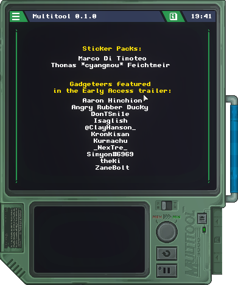

# yay


# hello world in nasm
```x86asm
org 0x7c00
bits 16

main:
  mov si, hello_world
  call print

print:
  mov ah, 0x0e
.loop:
  mov al, [si]
  cmp al, 0
  je .end

  int 10h

  inc si
  jmp .loop
.end:
  ret

hello_world: db 'Hello, World!', 0

times 510-($-$$) db 0
dw 0xaa55

```
